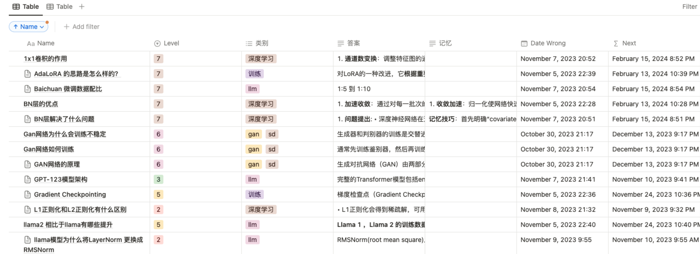

## README for Notion-Integrated Ebbinghaus Memory Assistant with OpenAI TTS and LLM Feedback

## Overview
This application integrates a simplified version of the Ebbinghaus forgetting curve with Notion, aimed at enhancing memory retention through repeated review. The script automates the process of scheduling reviews and provides an interactive way to test and reinforce learning.

## Features
Ebbinghaus Memory Curve Scheduling: Implements a review schedule in Notion based on the Ebbinghaus forgetting curve, optimizing memory retention.
OpenAI TTS Integration: Enhances user engagement by reading questions and feedback aloud using OpenAI's TTS service.
LLM Feedback Mechanism: Utilizes OpenAI's LLM to autonomously assess user responses, providing immediate correctness feedback.
Interactive Voice-Prompted Reviews: Offers a hands-free review experience by allowing users to respond verbally to prompts.
Automated Review Tracking: Dynamically updates the review schedule in Notion based on user performance.

## How it Works
1. **Fetching Review Data**: The `get_review_data` function retrieves data from the Notion database, identifying items due for review based on the current date and time.
2. **Session Handling**: For each review item, the question is read aloud, and the user's spoken response is captured and evaluated.
3. **Feedback Generation**: The script provides immediate feedback on the correctness of the user's response, using the `chatllm` function.

## Requirements
- Notion Database ID and API Token: These are necessary for accessing and modifying the Notion database.
- Environment Setup: The application requires the `.env` file for configuration.

## Usage
- Set up the Notion database with the required properties and formulae for scheduling.
- Configure the `.env` file with your Notion credentials.
- Run the script to start an interactive review session.

## Notion Database Configuration
The Notion database should have the following columns:
- `Next`: Date of the next review, calculated based on the Ebbinghaus curve.
```if(prop("Level") == "2", dateAdd(prop("Date Wrong"), 1, "days"), if(prop("Level") == "3", dateAdd(prop("Date Wrong"), 3, "days"),if(prop("Level") == "4", dateAdd(prop("Date Wrong"), 8, "days"), if(prop("Level") == "5", dateAdd(prop("Date Wrong"), 19, "days"), if(prop("Level") == "6", dateAdd(prop("Date Wrong"), 44, "days"), if(prop("Level") == "7", dateAdd(prop("Date Wrong"), 100, "days"), if(prop("Level") == "8", dateAdd(prop("Date Wrong"), 226, "days"), if(prop("Level") == "9", dateAdd(prop("Date Wrong"), 510, "days"), if(prop("Level") == "gg", dateAdd(prop("Date Wrong"), 1149, "days"), prop("Date Wrong"))))))))))```
- `Level`: The current memory strength level of the item, influencing the review interval.
- `Date Wrong`: The date when the answer was last incorrect, used as a base for calculating the next review date.


## Conclusion
This script is an effective tool for anyone looking to enhance their learning and memory retention using the principles of the Ebbinghaus forgetting curve, combined with the convenience and flexibility of Notion.